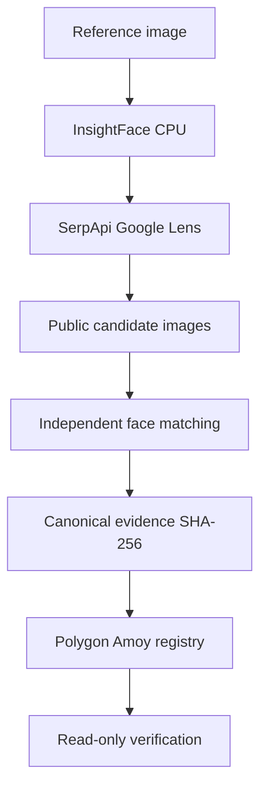

# Architecture

The search client is isolated from face analysis, downloading is bounded and failure-tolerant, and the blockchain layer receives only a 32-byte fingerprint. A missing credential, inaccessible image, absent face, malformed API response, failed transaction, or mismatched verification prevents a false success.
